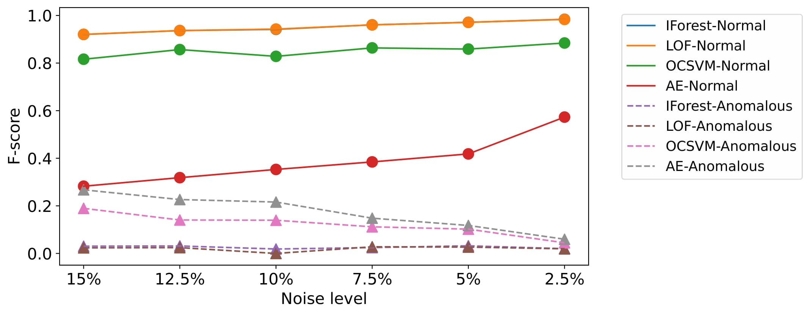
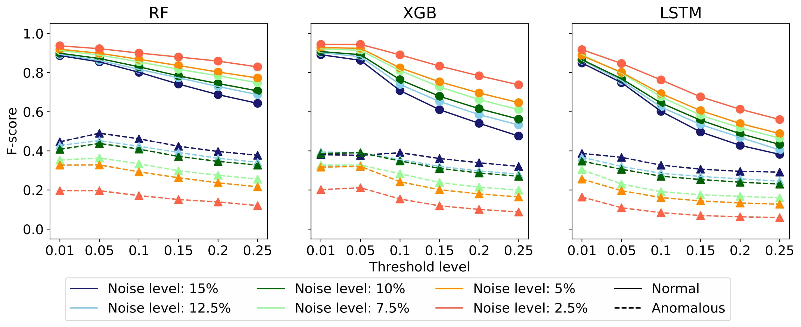
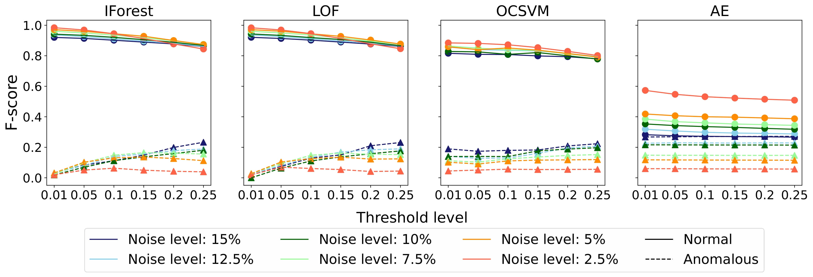
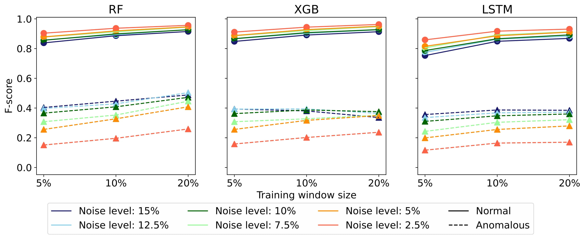
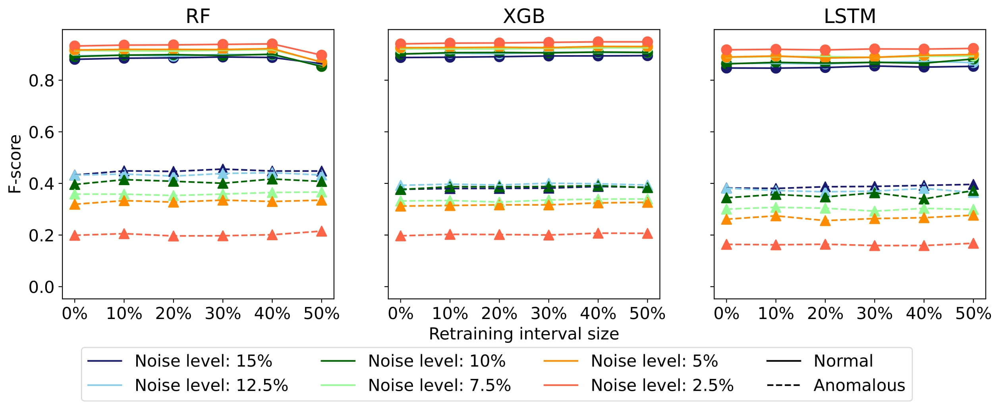
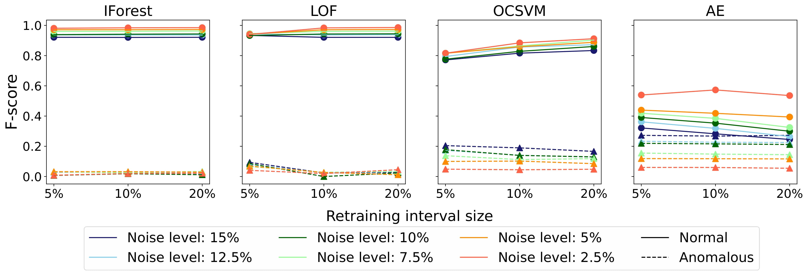

# The Analysis of Online Event Streams: Predicting the Next Activity for Anomaly Detection

## Suhwan Lee, Xixi Lu, and Hajo A. Reijers

Utrecht University

### This paper is

Anomaly detection in process mining focuses on identifying
anomalous cases or events in process executions. The resulting diagnostics are used to provide measures to prevent fraudulent behavior, as well as to derive recommendations for improving process compliance and security. Most existing techniques focus on detecting anomalous cases in an offline setting. However, to identify potential anomalies in a timely manner and take immediate countermeasures, it is necessary to detect event-level anomalies online, in real-time. In this paper, we propose to tackle the online event anomaly detection problem using next-activity prediction methods. More specifically, we investigate the use of both ML models (such as RF and XGBoost) and deep models (such as LSTM) to predict the probabilities of next-activities and consider the events predicted unlikely as anomalies. We compare these predictive anomaly detection methods to four classical unsupervised anomaly detection approaches (such as Isolation forest and LOF) in the online setting. Our evaluation shows that the proposed method using ML models tends to outperform the one using a deep model, while both methods outperform the classical unsupervised approaches in detecting anomalous events.

 

## Approach

__Proposed approach__

    

__Sliding Window__

    

 
 

<a href="evaluation_settings.md"><h2 id="Evaluation settings">Evaluation settings</h2></a>

 

## Result

#### F-score of proposed approach and baseline

    
       

#### Performance comparison by threshold

    
       

#### Performance comparison by window size

    
       

#### Performance comparison by retraining interval

    
       

